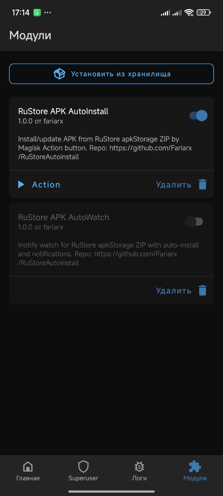
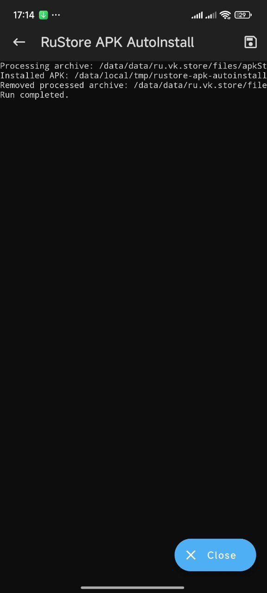

# RuStore APK AutoInstall (Magisk Module)

Repository: https://github.com/Fariarx/RuStoreAutoinstall

## Что делает:

Модуль нужен если загруженные приложения в RuStore не устанавливаются. Тестировалось на HyperOS android 15, где мне встретилась подобная проблема. Так же встречал этот баг на android 16. Никакие пути решения и настройки OS не сработали, пришлось написать этот скрипт. Так что если у вас похожая проблема на кастомной прошивке, welcome! 

Поддерживается установка RuStore обновлений для приложений из Google Play.

Модуль сканирует директорию:

`/data/data/ru.vk.store/files/apkStorage`

на предмет .zip файлов, извлекает .apk и устанавливает, в конце очищает скачанынй .zip архив из RuStore. 

## RuStore-AutoInstall-Manual-v1.0.0.zip (рекомендуется)
Ручной запуск обновления и установки загруженных в RuStore приложений через кнопку Action в Magisk.

Установка:
1. Скачать скрипт
2. Установить в Magisk
3. Перезагрузить устройство.
4. В RuStore загрузить обновления или приложения.
5. Запустить скрипт через Magisk, через кнопку Action.
6. Откроется лог выполнения установки.

